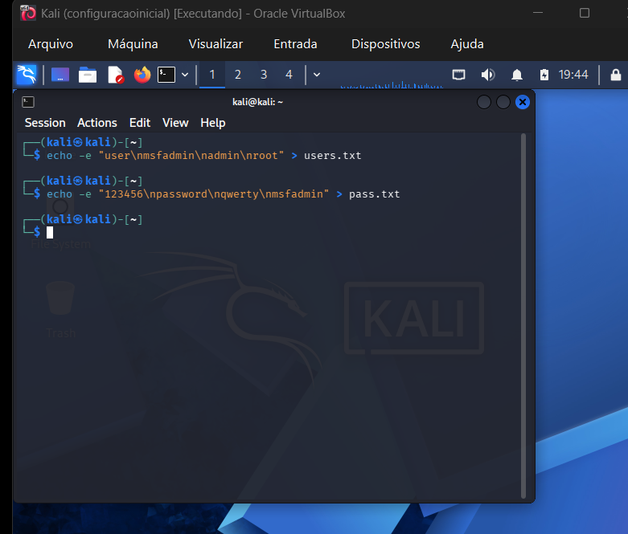
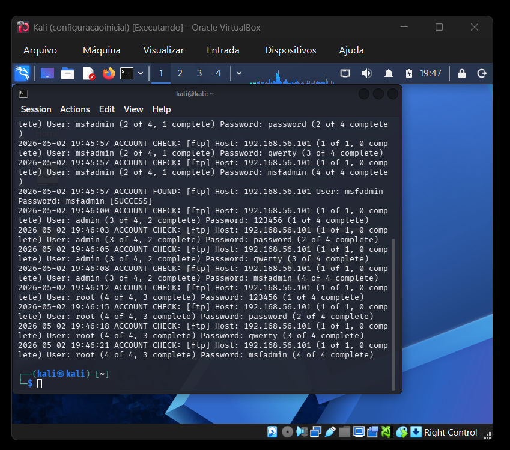
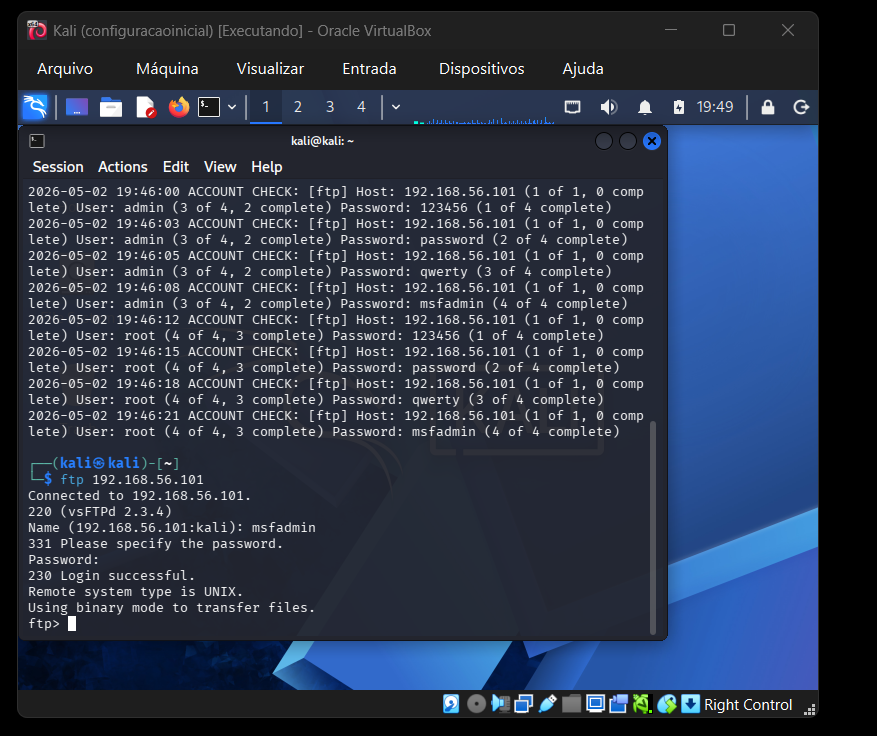
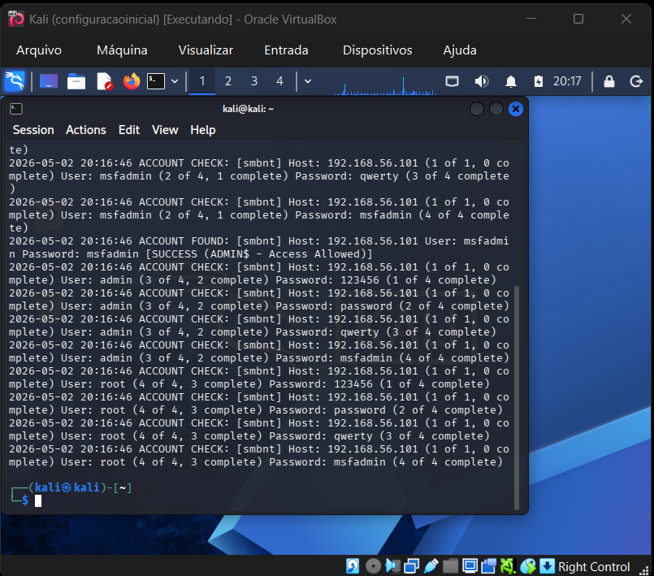

# 🛡️ Auditoria de Segurança: Brute Force e Mitigação em Serviços de Rede

## 🎯 Objetivo do Projeto
Este projeto prático faz parte do desafio da **DIO**. O objetivo é documentar a execução de ataques simulados de força bruta (Brute Force e Password Spraying) contra os serviços FTP e SMB em um ambiente controlado, com foco na análise de vulnerabilidades e na proposição de medidas de mitigação estratégicas.

## 💻 Ambiente Virtual e Ferramentas
* **Atacante:** Kali Linux
* **Alvo Vulnerável:** Metasploitable 2 (IP: 192.168.56.101)
* **Ferramenta de Auditoria:** Medusa
* **Isolamento de Rede:** Rede Interna (Host-only) configurada no VirtualBox para garantir a segurança da rede física.

## 🚀 Metodologia e Execução

Para simular os ataques, foram criados dicionários curtos (`users.txt` e `pass.txt`) contendo credenciais comuns e as credenciais padrão do sistema alvo.

**Criação das Wordlists:**

### 1. Auditoria no Serviço FTP (Porta 21)
O protocolo FTP transmite dados em texto claro e é frequentemente alvo de ataques. Utilizamos o Medusa para testar as combinações de credenciais.
* **Comando executado:** `medusa -h 192.168.56.101 -U users.txt -P pass.txt -M ftp`
* **Resultado:** Credencial comprometida (`msfadmin:msfadmin`). O acesso foi validado manualmente via terminal.

**Evidência do Ataque (Medusa):**

**Validação Manual do Acesso:**

### 2. Auditoria no Serviço SMB (Portas 139/445)
O SMB é utilizado para compartilhamento de arquivos em rede. O ataque simulou um *Password Spraying* para tentar acesso a recursos compartilhados.
* **Comando executado:** `medusa -h 192.168.56.101 -U users.txt -P pass.txt -M smbnt`
* **Resultado:** Acesso permitido ao compartilhamento administrativo (ADMIN$) com a credencial `msfadmin:msfadmin`.

**Evidência do Ataque (SMB):**

---

## 🔐 Recomendações de Mitigação (Blue Team)

A exploração bem-sucedida desses serviços em um ambiente real causaria vazamento de dados e possível movimentação lateral. Para mitigar esses riscos, recomendam-se as seguintes ações:

1. **Gestão de Identidade e Acesso (IAM):**
   * Implementar políticas de senhas fortes (complexidade, tamanho mínimo e expiração).
   * Desativar contas padrão ou alterar imediatamente suas credenciais após a instalação de sistemas.

2. **Políticas de Bloqueio (Account Lockout):**
   * Configurar o bloqueio temporário de contas após *N* tentativas falhas de login (ex: 5 tentativas em 5 minutos) para inviabilizar ataques de força bruta.

3. **Modernização de Protocolos:**
   * Descontinuar o uso de FTP (que não possui criptografia) e adotar protocolos seguros como **SFTP** ou **FTPS**.
   * Desativar o SMBv1 e garantir que o SMB esteja configurado para exigir assinatura de pacotes.

4. **Monitoramento e Resposta a Incidentes (SOC):**
   * Implementar soluções de **SIEM** para coletar logs de autenticação e gerar alertas em tempo real sobre picos de falhas de login.
   * Utilizar ferramentas ativas nos servidores, como o `Fail2Ban`, para bloquear automaticamente IPs de origem no firewall após atividades suspeitas.
